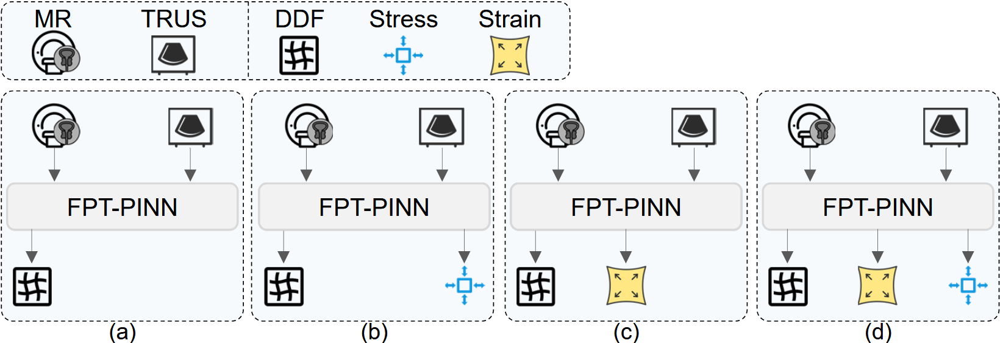
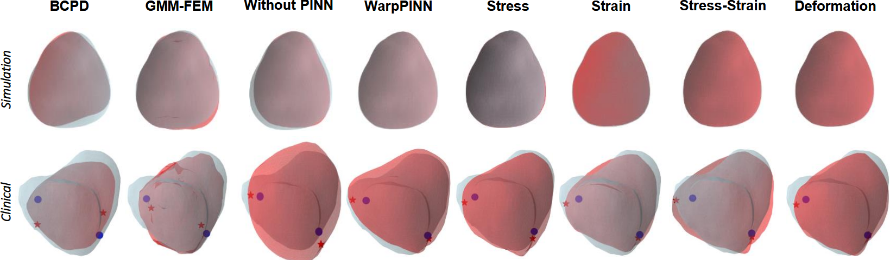
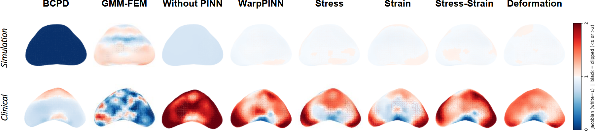

# PINNs-for-Point-Set-Registration  

[](https://arxiv.org/abs/2408.xxxxx)
[](https://drive.google.com/file/d/16ZNGCIL4RsnQH0xj3ZJ2c6ozL9UDoC82/view)

> **The Impact of Biomechanical Quantities on PINNs-based Medical Image Registration**  
> *Shixing Ma, Lin Zhaoxi, et al.*  
> MICCAI 2025 ASMUS 

---

## 🌟 Highlights
* **Four biomechanical PINN variants**: Stress, Strain, Stress-Strain, and Deformation prediction.  
* Robust on **simulation** and **clinical** MR–TRUS prostate datasets.  
* Deformation-prediction PINN cuts RMSE by **-87 %** on simulation data and achieves **4.9 mm TRE** clinically while nearly eliminating foldings.  

---

## 🔧 Framework  
<p align="center">
  </a>
</p>
<p align="center"><i>Fig. 1  Four FPT-PINN configurations predicting different physical quantities.</i></p>

---

## 📈 Qualitative Results  
<p align="center">
  </a>
</p>
<p align="center"><i>Fig. 2  Surface overlap comparison on simulation (top) and clinical (bottom) cases.</i></p>

<p align="center">
  </a>
</p>
<p align="center"><i>Fig. 3  Jacobian-determinant maps; smoother J≈1 indicates more physical deformations.</i></p>


### 📊 Quantitative Results – Simulation Dataset

| Method                 | RMSE (mm) ↓       | CD (mm) ↓         | %neg J ↓      |
| ---------------------- | ----------------- | ----------------- | ------------- |
| **Deformation (Ours)** | **0.219 ± 0.057** | **0.194 ± 0.057** | **0**         |
| Stress-Strain (Ours)   | 0.242 ± 0.147     | 0.217 ± 0.098     | 0             |
| Stress                 | 0.264 ± 0.098     | 0.240 ± 0.147     | 0             |
| WarpPINN               | 0.298 ± 0.095     | 0.269 ± 0.095     | 0             |
| Strain (Ours)          | 0.305 ± 0.116     | 0.273 ± 0.116     | 0.004 ± 0.020 |
| GMM-FEM                | 1.528 ± 0.912     | 0.916 ± 1.291     | 1.673 ± 2.670 |
| FPT (no PINN)          | 1.748 ± 0.912     | 1.260 ± 0.913     | 0             |
| BCPD                   | 2.326 ± 5.811     | 0.951 ± 2.669     | 0.013 ± 0.061 |

---

### 📊 Quantitative Results – Clinical Dataset

| Method                 | TRE (mm) ↓        | CD (mm) ↓         | %neg J ↓           |
| ---------------------- | ----------------- | ----------------- | ------------------ |
| **Deformation (Ours)** | **4.924 ± 1.542** | **2.125 ± 0.291** | 0.278 ± 0.312      |
| Strain (Ours)          | 5.359 ± 1.746     | 2.129 ± 0.259     | 0.459 ± 0.669      |
| Stress                 | 5.694 ± 1.780     | 2.170 ± 0.285     | 0.296 ± 0.408      |
| WarpPINN               | 5.771 ± 2.033     | 2.150 ± 0.294     | 0.506 ± 0.720      |
| FPT (no PINN)          | 5.901 ± 1.981     | 2.316 ± 0.347     | 0.281 ± 0.336      |
| GMM-FEM                | 5.899 ± 2.797     | 2.280 ± 0.289     | 24.976 ± 1.358     |
| Stress-Strain (Ours)   | 5.912 ± 2.008     | 2.133 ± 0.252     | 0.346 ± 0.427      |
| BCPD                   | 9.535 ± 6.907     | 3.952 ± 3.744     | **0.030 ± 0.106**  |


<details>
<summary>📄 Full tables & p-values</summary>

*See `tables/` folder or the supplementary PDF for complete metrics and statistical tests.*
</details>

---

## 🔥 Usage

```bash
git clone https://github.com/Msx00/PINNs-for-Point-Set-Registration.git
cd PINNs-for-Point-Set-Registration

# put the downloaded checkpoint here:
# ./log/xxxxx/checkpoints/model_best.pt

python demo_register.py --cfg configs/deformation.yaml


## Contributors

- [Zhaoxi Lin](https://github.com/Lzhaoxi)  
